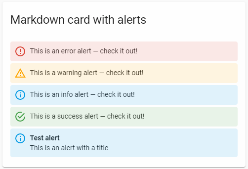

# Markdown
## Tarea 1 markdown

### Ejemplo párrafo	

Markdown es un lenguaje de marcado ligero creado por **John Gruber** y **Aaron Swartz** *que trata de conseguir la máxima legibilidad y facilidad de publicación tanto en su forma de entrada como de salida*, inspirándose en muchas convenciones existentes para marcar mensajes de correo electrónico usando texto plano.
	
### Ejemplo de código 
	
$$\int_{=\infty}^\infty e^(-x^2) = \sqrt{\pi}$$

### Lista ordenada

1. Andar
2. Correr
3. Volar

### Lista desordenada

- Markdown
- HTML
- XML

### Enlaces
**Externo:** [Sintáxis de markdown](https://markdown.es/sintaxis-markdown/)

**Fichero markdown:** [Fichero](enlace_markdown.md)

### Imagen

### Tabla

|   | Markdown  |  HTML |
|---|---|---|
|  **Título** | #  | < h1>  |
| **Negrita**  | ** **x** **  |< b >**x** < /b >  |
| **Cursiva**  | * *X* *  | < i >*X* </ i >  |